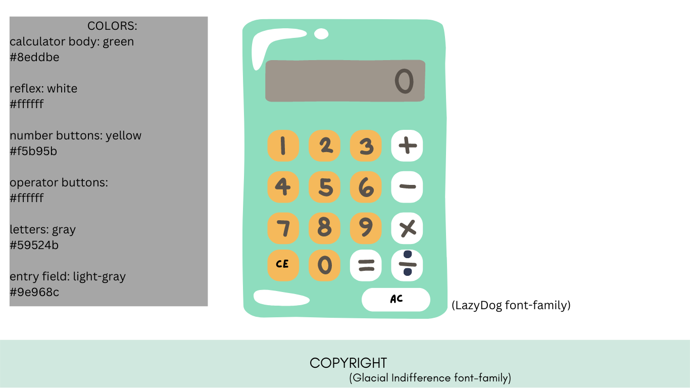

# JS-Calculator

A simple Javascript Calculator using HTML and CSS to The Odin Project 
last Fundamentals Exercise.  

## Algorithym idea:

* Each time an operator button is pressed, a variable called operator receive
one of a lack of operator functions (sum, subtract, divid, etc).   

* There is a two size result array which receives input from the number buttons
when they are pressed.   

* The first array position only change to the second after an operator button
is pressed   

* The result btn call the operator variable with the array0 and array1
parameters   

* Another way to do is to set each operation as an object to be called   

---

## To be done:      

1. Add onclick event in each button to become smaller;
2. Add the javascript functions to the calculator;
3. Edit the footer;
4. A clear entry button?

## Calculator Sample with Colors and Font Family

