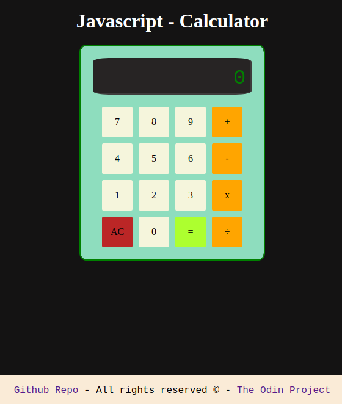

# JS-Calculator

A simple Javascript Calculator using HTML and CSS to [The Odin Project](https://theodinproject.com).
The Odin Project is a self-taught course focused on full stack web development.  

---

## Calculator Sample

---

## Simple requirements of the first algorithm idea

* There is a two size result array which receives input from the number buttons
when they are pressed.   

* There are buttons of arithmetic operations (a.k.a operator buttons).  

* Each time an operator button is pressed, a variable called curOperator receive
one function from a lack of predefined operator functions (sum, subtract, divid,
etc).   

* The first array position only change to the second after an operator button
is pressed   

* There is a result button which calls the operator variable with the array0 and array1
parameters   

* Also, when an operator button is pressed more than once after number inputs, it will
display the result.  

* When a number is not sent as input, it should use the previous number used.   
